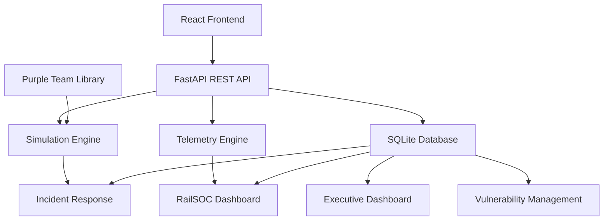

# 🚂 TrackSentinel


### RailSOC Training & Simulation Platform

### Operational Technology Cybersecurity • Railroad Infrastructure • Industrial Control Systems

</p>

<p align="center">

A full-stack Operational Technology (OT) cybersecurity platform simulating a modern Railroad Security Operations Center (RailSOC) used for monitoring, detection, investigation, incident response, executive reporting, and purple team exercises across railroad operational technology environments.

</p>

---

<p align="center">


</p>

---

# Overview

TrackSentinel is a modern Operational Technology (OT) cybersecurity platform developed to demonstrate cybersecurity monitoring, incident response, threat intelligence, executive reporting, and purple team exercises within a simulated railroad environment.

Unlike traditional SOC dashboards that focus exclusively on IT infrastructure, TrackSentinel models a railroad Operational Technology network consisting of SCADA systems, signaling infrastructure, Positive Train Control (PTC), communications equipment, engineering workstations, environmental monitoring, safety systems, and critical railroad infrastructure.

The platform combines cybersecurity operations with operational awareness, allowing simulated cyber events to influence operational telemetry, incident workflows, asset health, and executive security posture.

Although inspired by real OT security concepts, all attacks, alerts, telemetry, vulnerabilities, and incidents are fully simulated for educational, training, and portfolio purposes.

---

# Why TrackSentinel?

Industrial environments differ significantly from enterprise IT environments.

Operational Technology systems prioritize:

- Availability
- Safety
- Reliability
- Continuous operations
- Physical process control

rather than traditional confidentiality-focused enterprise security.

TrackSentinel demonstrates how cybersecurity analysts can monitor, investigate, and respond to cyber threats affecting railroad operational technology while balancing operational continuity and safety.

The platform brings together:

- Executive Cybersecurity Dashboards
- SOC Monitoring
- OT Asset Management
- Vulnerability Management
- Live Operational Telemetry
- Incident Response
- Investigation Workspaces
- Threat Intelligence
- Purple Team Exercises
- MITRE ATT&CK for ICS mappings

within a single unified training platform.

---

# 🚀 Feature Showcase

TrackSentinel provides a complete Operational Technology (OT) cybersecurity training environment modeled after a modern Railroad Security Operations Center (RailSOC).

The platform combines cybersecurity monitoring, operational awareness, incident response, executive reporting, and purple team exercises into a unified experience.

---

---

# 🚂 Simulated Railroad OT Environment

TrackSentinel models a realistic railroad Operational Technology (OT) environment consisting of dispatch systems, signaling infrastructure, communications, power systems, safety devices, engineering workstations, and infrastructure monitoring.

The environment is intentionally designed to represent the types of assets commonly found in modern freight and passenger railroad operations while remaining entirely fictional for training and demonstration purposes.

---

# 🖥️ Operations Control Center

The Operations Control Center (OCC) serves as the operational heart of the railroad environment.

### Dispatch SCADA Server

The Dispatch SCADA Server provides centralized visibility into railroad operational assets.

Responsibilities include:

- Operational monitoring
- Signal supervision
- Device status monitoring
- Communications aggregation
- Alarm generation

### Operations Historian

The Historian stores operational telemetry for reporting and historical analysis.

Collected information includes:

- Device health
- Operational telemetry
- Environmental data
- Historical trends
- Alarm history

### OT Jump Server

The Jump Server provides controlled administrative access into the OT environment.

Security considerations include:

- Multi-factor authentication
- Privileged access
- Session auditing
- Remote maintenance

---

# 🚦 Signal & Train Control

Signal systems are responsible for the safe movement of trains across the subdivision.

## Signal Controller 14A

Controls:

- Wayside signal indications
- Route logic
- Track occupancy response

## Signal Controller 14B

Provides additional signal control for adjacent territory.

## Signal Controller 15C

Controls western subdivision signal infrastructure.

### Security Risks

- Unauthorized logic modification
- Firmware tampering
- Remote engineering access
- Configuration drift

---

# 🚧 Grade Crossing Protection

TrackSentinel includes multiple simulated highway grade crossings.

### Grade Crossing Controller MP 82.4

Responsible for:

- Flashing lights
- Crossing gates
- Audible warning devices
- Train detection

### Grade Crossing Controller MP 87.1

Provides identical protection for a second roadway crossing.

### Security Risks

- Logic manipulation
- Communication failure
- Loss of train detection
- Safety system disruption

---

# 📡 Railroad Communications

Reliable communications are essential for railroad operations.

## Positive Train Control (PTC) Radio Gateway

Responsible for:

- PTC communications
- Wayside connectivity
- Dispatcher communications
- Operational messaging

## Microwave Radio

Provides long-distance wireless communications between field assets.

## Fiber Distribution Switch

Serves as the communications backbone connecting operational systems.

### Security Risks

- Denial of service
- Network reconnaissance
- Communication loss
- Unauthorized access

---

# ⚡ Power Systems

Operational Technology environments require highly available power systems.

### UPS System

Provides uninterrupted power during utility interruptions.

### Backup Generator PLC

Controls emergency generator operations.

Telemetry includes:

- Voltage
- Battery runtime
- Load percentage
- Generator status

### Security Risks

- Generator failure
- PLC manipulation
- Battery degradation
- Power loss

---

# 🔥 Safety Systems

Safety systems protect personnel and critical facilities.

## Fire Detection Panel

Monitors:

- Smoke detection
- Heat alarms
- Fire panel health

### Hydrogen Gas Detector

Protects battery rooms by monitoring hydrogen concentrations.

### Flood Detection Sensor

Detects water intrusion into communications vaults and equipment rooms.

### Cabinet Intrusion Sensor

Detects unauthorized access to field equipment cabinets.

### Security Risks

- Disabled safety monitoring
- False alarms
- Environmental damage
- Physical intrusion

---

# 🌉 Railroad Infrastructure Monitoring

Infrastructure monitoring provides additional operational awareness.

## Bridge Structural Monitor

Monitors:

- Structural vibration
- Temperature
- Infrastructure health

## Hot Bearing Detector

Monitors train bearings for overheating conditions.

Telemetry includes:

- Bearing temperature
- Equipment health
- Alarm conditions

### Security Risks

- False sensor readings
- Monitoring failure
- Missed safety events

---

# 💻 Engineering Systems

Engineering workstations provide maintenance access into operational technology environments.

## Rail Engineering Workstation

Supports:

- Controller programming
- Firmware updates
- Maintenance activities
- Configuration management

### Security Risks

- Credential compromise
- Malware
- Unauthorized engineering access
- Lateral movement

---

# 📊 Operational Telemetry

TrackSentinel dynamically simulates telemetry for each operational asset.

Examples include:

| Category | Example Metrics |
|----------|-----------------|
| Operations | CPU, Memory, Active Sessions |
| Signals | Controller CPU, Temperature |
| Communications | Signal Quality, Packet Loss |
| Power | Voltage, Runtime, Load |
| Environmental | Gas PPM, Humidity, Water Detection |
| Infrastructure | Bridge Vibration, Bearing Temperature |
| Security | Failed Logins, Door State, Tamper Status |

Telemetry automatically changes during simulated attack scenarios to reflect the operational impact of cybersecurity events.

---

# 📊 Executive Security Operations Dashboard

> Executive-level cybersecurity posture and operational risk overview.

*(Insert Screenshot: Executive Dashboard)*

```text
screenshots/executive-dashboard.png
```

### Capabilities

- Dynamic Overall Security Score
- Current Threat Level
- Protected Asset Percentage
- Mean Time to Detect (MTTD)
- Mean Time to Respond (MTTR)
- Compliance Status
- Open Incidents
- Critical Alerts
- Executive Recommendations
- Security Trend Indicators

### Demonstrates

- Executive Reporting
- Security Metrics
- Risk Communication
- Leadership Dashboards
- Operational Risk

---

# 🚦 RailSOC Dashboard

> The operational command center used by analysts during daily monitoring.

*(Insert Screenshot: Dashboard)*

```text
screenshots/dashboard.png
```

### Capabilities

- Environment Overview
- Railroad Operations Map
- Recent Incidents
- Top Active Alerts
- Live Asset Status
- Dynamic Threat Level
- Security KPIs

### Demonstrates

- Security Operations Center (SOC)
- Operational Technology Monitoring
- Threat Visualization
- Executive Awareness

---

# 🚂 Interactive Railroad Operations Map

> A digital visualization of the simulated railroad operational environment.

*(Insert Screenshot: Operations Map)*

```text
screenshots/operations-map.png
```

### Capabilities

- Dispatch Operations Center
- Railroad Signal Controllers
- Grade Crossing Controllers
- Positive Train Control (PTC)
- Communications Infrastructure
- Safety Systems
- Environmental Monitoring
- Bridge Monitoring
- Hot Bearing Detection
- Asset Detail Panel
- Incident Indicators
- Live Asset Health

### Demonstrates

- Operational Awareness
- Railroad Infrastructure
- OT Asset Monitoring
- Infrastructure Visualization

---

# 📡 Live Railroad Telemetry

> Real-time operational telemetry grouped by asset category.

*(Insert Screenshot: Telemetry)*

```text
screenshots/live-telemetry.png
```

### Asset Categories

#### Operations Systems

- Dispatch SCADA
- Operations Historian
- OT Jump Server

#### Signal & Crossing Systems

- Signal Controllers
- Grade Crossing Controllers
- Switch Controllers

#### Communications

- PTC Gateway
- Microwave Radio
- Fiber Distribution

#### Power Systems

- UPS
- Generator PLC

#### Safety & Environmental

- Fire Detection
- Hydrogen Gas Detection
- Flood Detection
- Cabinet Intrusion

#### Infrastructure

- Bridge Structural Monitoring
- Hot Bearing Detection

#### Engineering

- Engineering Workstations

### Telemetry Includes

- CPU Usage
- Memory Usage
- Network Latency
- Active Sessions
- Failed Logins
- Voltage
- Signal Quality
- Packet Loss
- Battery Runtime
- Gas Concentration
- Water Detection
- Door State
- Bridge Vibration
- Bearing Temperature

### Demonstrates

- Operational Monitoring
- ICS Telemetry
- OT Health Monitoring
- Environmental Monitoring

---

# 🌐 Railroad OT Network Topology

> Interactive visualization of the simulated railroad OT network.

*(Insert Screenshot: Topology)*

```text
screenshots/topology.png
```

### Network Zones

- Enterprise / OT Firewall
- Operations Core
- Signal & Train Control
- Communications
- Power Systems
- Safety Systems
- Engineering Access

Each node dynamically reflects:

- Operational Status
- Risk Level
- IP Address
- Device Type

### Demonstrates

- Network Segmentation
- Purdue Model Concepts
- OT Architecture
- Asset Relationships

---

# 🚨 Security Alerts

> Centralized monitoring of simulated cybersecurity events.

*(Insert Screenshot: Alerts)*

```text
screenshots/alerts.png
```

### Alert Types

- OT Network Reconnaissance
- Unauthorized Logic Modification
- PTC Communication Failure
- Unauthorized Engineering Login
- Denial of Service (Simulated)
- Malware Activity (Simulated)

Each alert includes

- Severity
- Device
- Timestamp
- Description
- Status
- MITRE Technique

### Demonstrates

- Security Monitoring
- Detection Engineering
- Alert Triage

---

# 📝 Incident Response Center

> Central workspace for managing operational cybersecurity incidents.

*(Insert Screenshot: Incident Center)*

```text
screenshots/incident-center.png
```

### Capabilities

- Incident Queue
- Acknowledge
- Assignment
- Investigation Notes
- Close Incident
- Analyst Tracking
- Timeline
- MITRE Mapping

### Demonstrates

- Incident Response
- Case Management
- Analyst Workflow
- Documentation

---

# 🔍 Investigation Workspace

> Analyst-focused investigation environment.

*(Insert Screenshot: Investigation Workspace)*

```text
screenshots/investigation-workspace.png
```

### Capabilities

- IOC Review
- Timeline
- Device Information
- Threat Summary
- Evidence Collection
- Analyst Notes
- Recommended Actions
- MITRE ATT&CK for ICS Mapping

### Demonstrates

- Digital Forensics
- Incident Investigation
- Threat Analysis
- OT Security Operations

---

---

# 🚂 Simulated Railroad OT Environment

TrackSentinel models a realistic railroad Operational Technology (OT) environment consisting of dispatch systems, signaling infrastructure, communications, power systems, safety devices, engineering workstations, and infrastructure monitoring.

The environment is intentionally designed to represent the types of assets commonly found in modern freight and passenger railroad operations while remaining entirely fictional for training and demonstration purposes.

---

# 🖥️ Operations Control Center

The Operations Control Center (OCC) serves as the operational heart of the railroad environment.

### Dispatch SCADA Server

The Dispatch SCADA Server provides centralized visibility into railroad operational assets.

Responsibilities include:

- Operational monitoring
- Signal supervision
- Device status monitoring
- Communications aggregation
- Alarm generation

### Operations Historian

The Historian stores operational telemetry for reporting and historical analysis.

Collected information includes:

- Device health
- Operational telemetry
- Environmental data
- Historical trends
- Alarm history

### OT Jump Server

The Jump Server provides controlled administrative access into the OT environment.

Security considerations include:

- Multi-factor authentication
- Privileged access
- Session auditing
- Remote maintenance

---

# 🚦 Signal & Train Control

Signal systems are responsible for the safe movement of trains across the subdivision.

## Signal Controller 14A

Controls:

- Wayside signal indications
- Route logic
- Track occupancy response

## Signal Controller 14B

Provides additional signal control for adjacent territory.

## Signal Controller 15C

Controls western subdivision signal infrastructure.

### Security Risks

- Unauthorized logic modification
- Firmware tampering
- Remote engineering access
- Configuration drift

---

# 🚧 Grade Crossing Protection

TrackSentinel includes multiple simulated highway grade crossings.

### Grade Crossing Controller MP 82.4

Responsible for:

- Flashing lights
- Crossing gates
- Audible warning devices
- Train detection

### Grade Crossing Controller MP 87.1

Provides identical protection for a second roadway crossing.

### Security Risks

- Logic manipulation
- Communication failure
- Loss of train detection
- Safety system disruption

---

# 📡 Railroad Communications

Reliable communications are essential for railroad operations.

## Positive Train Control (PTC) Radio Gateway

Responsible for:

- PTC communications
- Wayside connectivity
- Dispatcher communications
- Operational messaging

## Microwave Radio

Provides long-distance wireless communications between field assets.

## Fiber Distribution Switch

Serves as the communications backbone connecting operational systems.

### Security Risks

- Denial of service
- Network reconnaissance
- Communication loss
- Unauthorized access

---

# ⚡ Power Systems

Operational Technology environments require highly available power systems.

### UPS System

Provides uninterrupted power during utility interruptions.

### Backup Generator PLC

Controls emergency generator operations.

Telemetry includes:

- Voltage
- Battery runtime
- Load percentage
- Generator status

### Security Risks

- Generator failure
- PLC manipulation
- Battery degradation
- Power loss

---

# 🔥 Safety Systems

Safety systems protect personnel and critical facilities.

## Fire Detection Panel

Monitors:

- Smoke detection
- Heat alarms
- Fire panel health

### Hydrogen Gas Detector

Protects battery rooms by monitoring hydrogen concentrations.

### Flood Detection Sensor

Detects water intrusion into communications vaults and equipment rooms.

### Cabinet Intrusion Sensor

Detects unauthorized access to field equipment cabinets.

### Security Risks

- Disabled safety monitoring
- False alarms
- Environmental damage
- Physical intrusion

---

# 🌉 Railroad Infrastructure Monitoring

Infrastructure monitoring provides additional operational awareness.

## Bridge Structural Monitor

Monitors:

- Structural vibration
- Temperature
- Infrastructure health

## Hot Bearing Detector

Monitors train bearings for overheating conditions.

Telemetry includes:

- Bearing temperature
- Equipment health
- Alarm conditions

### Security Risks

- False sensor readings
- Monitoring failure
- Missed safety events

---

# 💻 Engineering Systems

Engineering workstations provide maintenance access into operational technology environments.

## Rail Engineering Workstation

Supports:

- Controller programming
- Firmware updates
- Maintenance activities
- Configuration management

### Security Risks

- Credential compromise
- Malware
- Unauthorized engineering access
- Lateral movement

---

# 📊 Operational Telemetry

TrackSentinel dynamically simulates telemetry for each operational asset.

Examples include:

| Category | Example Metrics |
|----------|-----------------|
| Operations | CPU, Memory, Active Sessions |
| Signals | Controller CPU, Temperature |
| Communications | Signal Quality, Packet Loss |
| Power | Voltage, Runtime, Load |
| Environmental | Gas PPM, Humidity, Water Detection |
| Infrastructure | Bridge Vibration, Bearing Temperature |
| Security | Failed Logins, Door State, Tamper Status |

Telemetry automatically changes during simulated attack scenarios to reflect the operational impact of cybersecurity events.

---

---

# 📈 Executive Security Dashboard

The Executive Security Dashboard provides leadership with a high-level view of the organization's current operational cybersecurity posture.

Unlike the analyst-focused RailSOC Dashboard, this interface emphasizes business risk, operational impact, and security metrics that support executive decision-making.

*(Insert Screenshot: executive-dashboard.png)*

## Executive KPIs

The dashboard continuously calculates and updates:

- Overall Security Score
- Current Threat Level
- Protected Asset Percentage
- Open Incidents
- Critical Alerts
- High-Risk Assets
- Mean Time to Detect (MTTD)
- Mean Time to Respond (MTTR)
- Compliance Status

---

## Threat Level Calculation

The platform dynamically determines the current operational threat level using simulated conditions.

| Threat Level | Description |
|--------------|-------------|
| 🟢 Normal | No significant security events detected |
| 🟡 Guarded | Elevated activity requiring analyst awareness |
| 🟠 Elevated | Multiple high-risk conditions affecting operations |
| 🔴 Critical | Active operational security incident impacting railroad systems |

Threat levels automatically update during purple team exercises and incident response activities.

---

## Executive Security Score

TrackSentinel calculates an overall security posture score using multiple simulated factors including:

- Asset Health
- Open Vulnerabilities
- Active Incidents
- Critical Alerts
- Device Availability
- High-Risk Assets
- Threat Intelligence
- Compliance Status

The score provides leadership with an easy-to-understand indicator of overall operational cybersecurity health.

---

## Operational Metrics

The Executive Dashboard presents operational metrics commonly reviewed by cybersecurity leadership.

### Mean Time to Detect (MTTD)

Measures how quickly simulated threats are identified.

### Mean Time to Respond (MTTR)

Measures the time required to investigate and resolve simulated incidents.

### Protected Assets

Displays the percentage of operational technology assets currently functioning within expected operational parameters.

### Operational Availability

Reflects the health and availability of simulated railroad operational technology.

---

## Executive Recommendations

Based on current platform conditions, TrackSentinel generates executive recommendations such as:

- Prioritize remediation of critical vulnerabilities
- Investigate active controller anomalies
- Review engineering workstation authentication activity
- Validate Positive Train Control communications
- Schedule maintenance windows for firmware updates
- Increase monitoring during elevated threat conditions

These recommendations provide leadership with actionable guidance without requiring detailed technical knowledge.

---

# ⚠️ Railroad OT Vulnerability Management

TrackSentinel includes a centralized vulnerability management module focused on Operational Technology assets.

*(Insert Screenshot: vulnerability-management.png)*

Each vulnerability includes:

- Device
- CVE Identifier
- Severity
- CVSS Score
- Current Status
- Recommended Remediation
- Operational Impact

---

## Example Vulnerability Workflow

```text
Vulnerability Identified
          │
          ▼
Risk Assessment
          │
          ▼
Prioritization
          │
          ▼
Engineering Coordination
          │
          ▼
Maintenance Window
          │
          ▼
Validation
          │
          ▼
Closed
```

Unlike enterprise IT environments, OT vulnerabilities often require coordination with engineering and operations teams to avoid disrupting critical railroad services.

---

# 📊 Executive Reports

TrackSentinel includes executive-oriented reporting designed to communicate cybersecurity posture to technical and non-technical stakeholders.

*(Insert Screenshot: reports.png)*

Reports summarize:

- Security Score
- Threat Level
- Asset Health
- Vulnerability Summary
- Incident Summary
- Alert Statistics
- Operational Availability
- Executive Recommendations

These reports are designed to support leadership briefings and cybersecurity program reviews.

---

# 🏗️ System Architecture

The TrackSentinel platform follows a modular client-server architecture.



---

# 🖥️ Application Architecture

```text
                     React Frontend

 ┌──────────────────────────────────────────────┐
 │ Executive Dashboard                          │
 │ RailSOC Dashboard                            │
 │ Live Telemetry                               │
 │ Operations Map                               │
 │ Incident Center                              │
 │ Investigation Workspace                      │
 │ Vulnerability Management                     │
 │ Purple Team Library                          │
 └──────────────────────────────────────────────┘

                    REST API

               FastAPI Application

                        │

        Simulation • Alerts • Incidents

                        │

                 SQLite Demonstration DB
```

---

# 💻 Technology Stack

## Frontend

- React
- React Router
- Vite
- CSS3
- JavaScript (ES6+)

---

## Backend

- Python
- FastAPI
- SQLAlchemy
- SQLite
- Uvicorn

---

## Cybersecurity Concepts

TrackSentinel demonstrates practical experience with:

- Operational Technology Security
- Industrial Control Systems (ICS)
- SCADA Security
- Railroad Operations
- Incident Response
- Threat Intelligence
- MITRE ATT&CK for ICS
- Vulnerability Management
- Purple Team Exercises
- Executive Security Reporting

---

# 📂 Repository Structure

```text
TrackSentinel
│
├── backend
│   ├── database.py
│   ├── main.py
│   ├── models.py
│   ├── seed.py
│   ├── simulation_engine.py
│   └── services/
│
├── frontend
│   ├── components/
│   ├── pages/
│   ├── services/
│   ├── App.jsx
│   └── App.css
│
├── screenshots/
│
├── README.md
│
└── LICENSE
```

---

---

# ⚙️ Installation

## Prerequisites

Before running TrackSentinel, ensure the following software is installed:

- Python 3.11+
- Node.js 20+
- npm
- Git

---

## Clone the Repository

```bash
git clone https://github.com/YOUR_USERNAME/TrackSentinel.git

cd TrackSentinel
```

---

# 🖥️ Backend Setup

Navigate to the backend folder.

```bash
cd backend
```

Create a virtual environment.

```bash
python -m venv venv
```

Activate it.

### Windows

```bash
venv\Scripts\activate
```

### Linux / macOS

```bash
source venv/bin/activate
```

Install dependencies.

```bash
pip install -r requirements.txt
```

Initialize the demonstration database.

```bash
python seed.py
```

Start the API.

```bash
uvicorn main:app --reload
```

The backend will be available at:

```
http://127.0.0.1:8000
```

Interactive API documentation:

```
http://127.0.0.1:8000/docs
```

---

# 💻 Frontend Setup

Open a second terminal.

```bash
cd frontend
```

Install packages.

```bash
npm install
```

Start the React application.

```bash
npm run dev
```

Open:

```
http://localhost:5173
```

---

# 🎮 Demonstration Workflow

A typical TrackSentinel demonstration follows this workflow:

```text
Launch Platform

↓

Review Executive Dashboard

↓

Open RailSOC Dashboard

↓

Launch Purple Team Exercise

↓

Observe Alerts

↓

Investigate Incident

↓

Review Live Telemetry

↓

Analyze Threat Intelligence

↓

Document Findings

↓

Close Incident

↓

Generate Executive Report
```

---

# 🟣 Example Purple Team Scenario

### Scenario

Unauthorized Logic Modification

### Simulated Target

Grade Crossing Controller MP 82.4

### Platform Response

✔ Critical Alert Generated

✔ Incident Created

✔ Threat Level Elevated

✔ Telemetry Updated

✔ Investigation Workspace Populated

✔ Executive Dashboard Updated

✔ Timeline Created

✔ MITRE ATT&CK Technique Displayed

---

# 🧩 Skills Demonstrated

TrackSentinel showcases practical knowledge across multiple cybersecurity disciplines.

## Operational Technology

- Industrial Control Systems (ICS)
- SCADA Security
- Railroad Operational Technology
- Purdue Model Concepts
- Asset Monitoring
- Engineering Workstations

---

## Security Operations

- Security Monitoring
- Incident Response
- Threat Detection
- Alert Triage
- Threat Intelligence
- Investigation Workflow
- Purple Team Operations

---

## Security Frameworks

- MITRE ATT&CK for ICS
- Vulnerability Management
- Risk Assessment
- Executive Reporting
- Security Metrics

---

## Software Development

### Frontend

- React
- Vite
- React Router
- Component Architecture
- Responsive Design

### Backend

- FastAPI
- SQLAlchemy
- REST APIs
- SQLite
- Python

---

## Additional Concepts

- Executive Dashboards
- Telemetry Simulation
- Operational Risk
- Asset Inventory
- Infrastructure Monitoring
- Environmental Monitoring
- Safety Systems
- Network Topology Visualization

---

# 🚀 Future Roadmap

TrackSentinel continues to evolve with additional planned capabilities.

## Version 2.0

### Railroad Digital Twin

- Moving train simulation
- Live train positioning
- Signal state changes
- Operational route visualization

### Operations Map

- Interactive mileposts
- Expandable railroad locations
- Asset clustering
- Geographic overlays

### Enhanced Telemetry

- Historical trending
- Graphs
- Performance history
- Operational baselines

### Security

- IOC Database
- Threat Hunting Dashboard
- SIEM-style searching
- Audit Logging
- Role-Based Access Control

---

## Version 3.0

Future concepts under consideration include:

- Docker deployment
- PostgreSQL support
- Authentication
- Multi-user analyst environment
- PDF executive reports
- AI-assisted investigations
- Natural language reporting
- Live threat feeds
- Multi-subdivision railroad environments
- GIS integration

---

# 🎯 Project Goals

TrackSentinel was developed to demonstrate how modern cybersecurity concepts can be applied within Operational Technology environments.

The project emphasizes:

- Operational awareness
- Incident response
- Cybersecurity visualization
- Executive reporting
- Railroad infrastructure protection
- OT asset monitoring
- Security operations workflows

---

# ⚠️ Safety Notice

TrackSentinel is a simulated cybersecurity platform.

The project **does not** perform:

- Real denial-of-service attacks
- Unauthorized access
- Malware execution
- Exploitation
- Packet flooding
- Controller manipulation
- Network intrusion

All attack scenarios are simulated within the application for educational, portfolio, and demonstration purposes.

---

# 👤 About the Author

## Rusty Folsom

Technical Services Administrator • Cybersecurity Professional • Operational Technology Security Enthusiast

Areas of focus include:

- Operational Technology (OT)
- Industrial Control Systems (ICS)
- Railroad Cybersecurity
- Incident Response
- Threat Intelligence
- Purple Team Exercises
- Network Security
- SCADA Security
- Executive Security Reporting

---

## Connect

- GitHub: https://github.com/YOUR_USERNAME
- LinkedIn: https://linkedin.com/in/YOUR_PROFILE

---

# ⭐ Acknowledgements

This project draws inspiration from publicly available guidance and best practices related to Operational Technology cybersecurity, industrial control systems, railroad operations, and the MITRE ATT&CK® for ICS framework.

TrackSentinel is an independent portfolio project created for educational and professional demonstration purposes and is not affiliated with any railroad, transportation company, equipment manufacturer, or government agency.

---

<p align="center">

## 🚂 TrackSentinel

**Operational Technology • Railroad Cybersecurity • Executive Reporting • Purple Team Simulation**

**Built with React • FastAPI • Python**

⭐ If you found this project interesting, consider starring the repository.

</p>

