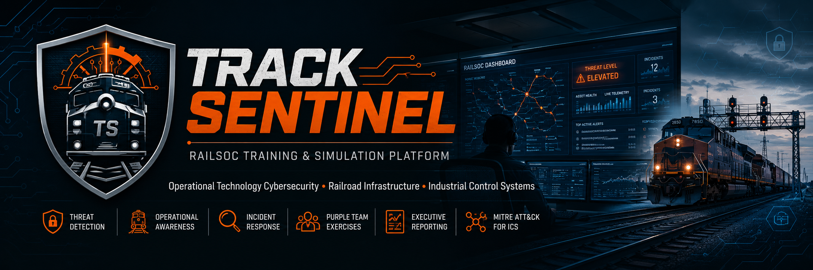
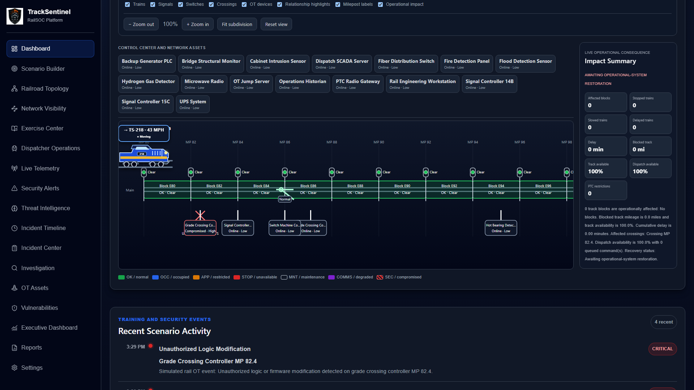
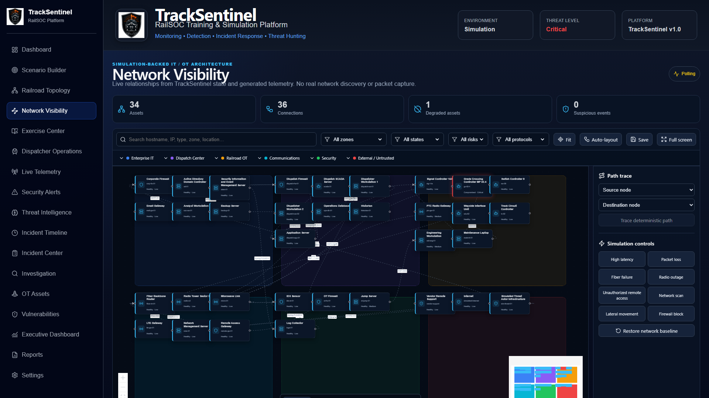
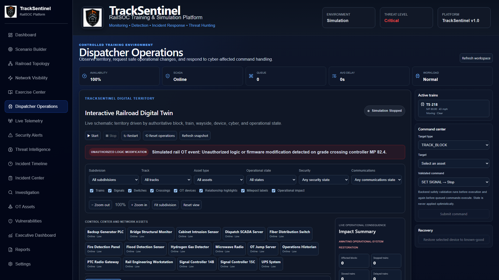
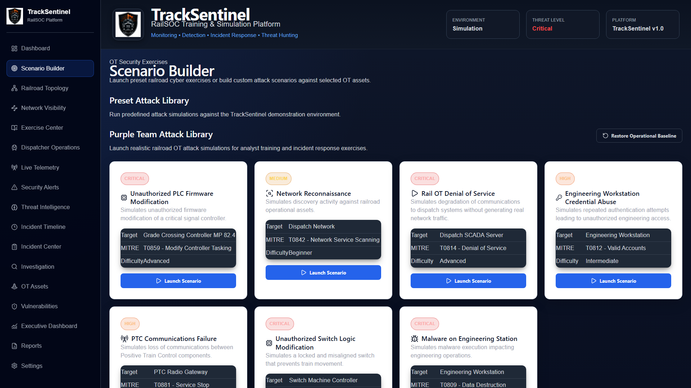
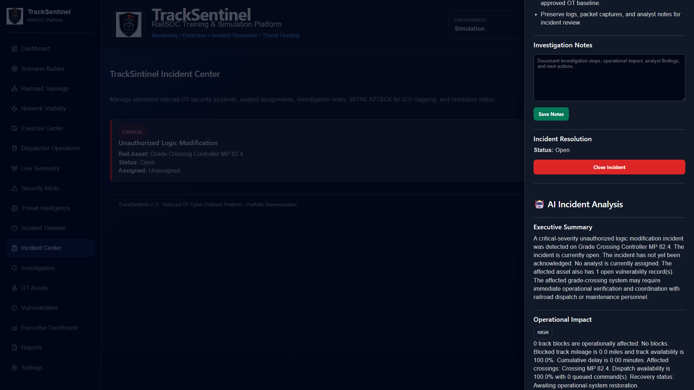
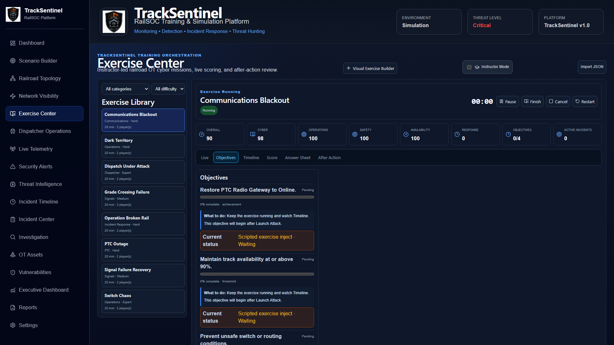
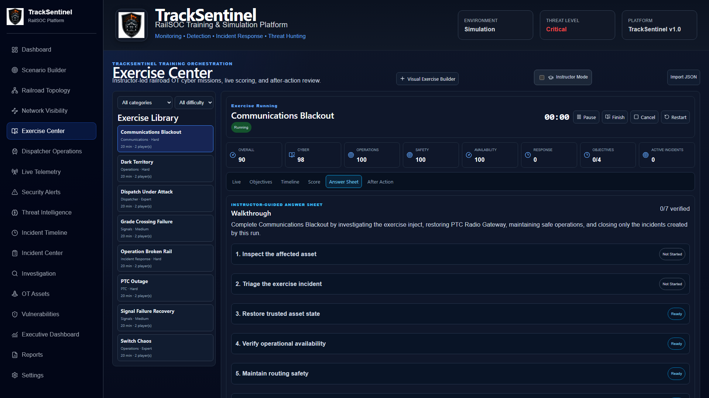
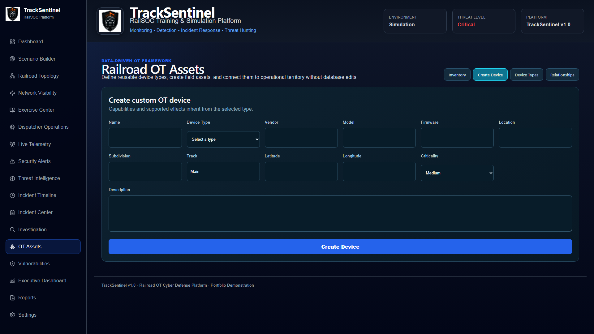
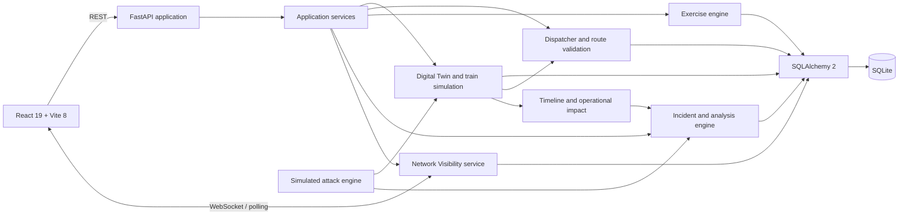

<p align="center">
  
</p>

# TrackSentinel

### Railroad OT Cybersecurity Digital Twin & Purple Team Training Platform

<p>
  
  
  
  
  
  
  
  
  <a href="LICENSE"></a>
</p>

TrackSentinel is a full-stack railroad Operational Technology (OT) cybersecurity training platform. It combines an interactive railroad digital twin, live train simulation, Purple Team scenarios, dispatcher operations, network visibility, incident response, deterministic analysis, and operational-impact modeling in one local application. It is a simulation: it does not connect to or control real railroad systems, and all attacks, telemetry, incidents, and operational effects remain inside the application.

## Platform highlights

- Live schematic territory with trains, track blocks, signals, switches, crossings, mileposts, and OT assets
- Dispatcher route validation, queued commands, restrictions, recovery actions, and simulated SCADA delay/blocking
- Six-zone IT/OT topology with 34 seeded nodes, 36 connections, path tracing, simulated traffic, and live updates
- Purple Team attack catalog and a data-driven custom scenario builder
- Eight seeded exercises with objectives, scoring, hints, checkpoints, walkthroughs, and after-action reports
- Incident Center workflows for acknowledgement, assignment, investigation notes, closure, and MITRE ATT&CK for ICS context
- Rule-based incident and operations analysis with technical recommendations and operational-impact metrics
- Extensible OT device types, capabilities, relationships, and supported simulated effects

## Capability status

| Capability | Status | Notes |
|---|---|---|
| Railroad Digital Twin | Available | Simulation-backed operational map |
| Live Train Simulation | Available | Start, stop, restart, and reset controls |
| Dispatcher Console | Available | Route, command, restriction, and recovery workflows |
| Network Visibility | Available | Simulated topology and telemetry only |
| Purple Team Attack Library | Available | Catalog-driven simulated effects |
| Custom Scenario Builder | Available | Select attacks and target assets |
| Custom OT Device Framework | Available | Types, capabilities, relationships, and effects |
| Exercise Mode | Available | Objectives, scoring, events, hints, and checkpoints |
| Walkthroughs and AAR | Beta | Instructor answer sheets and exportable reports |
| Incident Analysis | Available | Deterministic, rule-based analysis; no external LLM |
| AI Adversary | Planned | No autonomous adversary is implemented |
| Authentication / Multi-user Exercises | Planned | Current application is a local single-user demo |

## Quick demonstration workflow

1. Open the dashboard and review the seeded railroad territory.
2. Launch a catalog attack from **Scenario Builder**.
3. Observe the affected train, block, signal, crossing, or OT asset in the **Railroad Digital Twin**.
4. Review route constraints and recovery options in **Dispatcher Operations**.
5. Open the generated incident, assign it, add investigation notes, and review its analysis.
6. Start an exercise, follow the objective guidance, request hints, and inspect the walkthrough or after-action report.

## Screenshots

### Digital twin territory



### IT/OT network topology



### Dispatcher console



### Purple Team Library



### Incident Analysis



### Exercise Mode





### OT device framework



The complete gallery and reproducible capture details are in [docs/screenshots/README.md](docs/screenshots/README.md).

## Core features

### Railroad Digital Twin

The digital twin projects authoritative backend state into an interactive SVG territory. A live train moves through seeded East Subdivision blocks while block occupancy, signals, switch position, grade-crossing state, communications health, and security state update around it. Catalog attacks can apply supported effects to related assets, create incidents, restrict operations, and produce timeline and impact records. Reset and recovery actions return simulated state to baseline.

### Dispatcher Operations

The dispatcher workspace exposes active trains, target controls, route requests, command queues, active restrictions, recovery actions, and the operations timeline. Route requests are revalidated against block occupancy and required signal/switch states before reservation. Commands can be queued, blocked, retried, or cancelled; a configurable delay models degraded dispatch communications without moving a switch beneath a train or bypassing route-safety checks.

### Network Visibility

Network Visibility renders a seeded six-zone IT/OT architecture with interactive nodes and connections. Analysts can filter assets, inspect details, trace deterministic paths, save layouts, generate approved simulated conditions, and review historical generated traffic. A WebSocket provides live snapshots when a compatible client/server WebSocket transport is installed; the UI falls back to polling. The feature performs no discovery, scanning, packet capture, or firewall changes on real networks. See [docs/network-visibility.md](docs/network-visibility.md).

### Purple Team and Exercise Mode

The Purple Team library maps catalog attacks to supported simulated OT effects. The custom scenario builder previews operational impact before targeting seeded devices. Exercise Mode adds mission briefings, visible and hidden objectives, ordered hints, timed/scripted events, checkpoints, five score dimensions, instructor validation, answer-sheet walkthroughs, and downloadable after-action reports. See [docs/exercise-mode.md](docs/exercise-mode.md).

### Incident response and analysis

The Incident Center supports acknowledgement, analyst/team assignment, investigation notes, closure, severity, asset context, and MITRE ATT&CK for ICS mapping. Its analysis endpoint produces an executive summary, operational impact, likely-cause assessment, recommendations, and device context. This is transparent rule-based logic in `backend/ai_assistant.py`; the current repository does not call an external LLM.

### Custom OT devices

The asset framework creates reusable device types and instances without direct database editing. Types declare capabilities; capabilities expose compatible simulated effects. Devices can be related to track blocks and operational assets so that supported cyber effects appear in the digital twin and impact model.

## System architecture


```mermaid
flowchart LR
    UI[React 19 + Vite 8] -->|REST| API[FastAPI application]
    UI <-->|WebSocket / polling| NET[Network Visibility service]
    API --> CORE[Application services]
    CORE --> DT[Digital Twin and train simulation]
    CORE --> DSP[Dispatcher and route validation]
    CORE --> EX[Exercise engine]
    CORE --> IR[Incident and analysis engine]
    CORE --> NET
    DT --> ORM[SQLAlchemy 2]
    DSP --> ORM
    EX --> ORM
    IR --> ORM
    NET --> ORM
    ORM --> DB[(SQLite)]

    ATTACK[Simulated attack engine] --> DT
    ATTACK --> IR
    DT --> DSP
    DT --> IMPACT[Timeline and operational impact]
    IMPACT --> IR
```

TrackSentinel is currently a local monolithic application, not a distributed or cloud architecture. See [docs/architecture.md](docs/architecture.md) for component boundaries and data flow.

## Technology stack

| Area | Technologies |
|---|---|
| Frontend | React 19.2, React Router 7.18, Vite 8.1, Axios 1.18, Lucide React |
| Visualization | `@xyflow/react` 12.11 and a custom SVG railroad map |
| Backend | Python, FastAPI 0.116.1, Pydantic 2.11.7, Uvicorn 0.35.0 |
| Persistence | SQLAlchemy 2.0.43 with SQLite |
| Live updates | FastAPI WebSocket endpoint with polling fallback |
| Analysis | Deterministic Python rules; no external model dependency |
| Testing | Python `unittest`, Node test runner, Oxlint, Vite build, Playwright screenshots |

## Requirements

- **Python:** 3.14.4 is the repository’s verified local runtime. The project does not currently declare a formal minimum Python version.
- **Node.js:** `^20.19.0` or `>=22.12.0`, as required by Vite 8. The verified runtime is Node 24.16.0 with npm 11.13.0.
- **Git** and a current Chromium-, Firefox-, or WebKit-based desktop browser.
- Windows PowerShell commands are shown below; equivalent Bash activation is included for Linux/macOS.
- Docker is not required and no Docker configuration is currently included.

## Installation

```bash
git clone https://github.com/rustykleather-ux/RailSOC-Cyber-Defense-Platform.git
cd RailSOC-Cyber-Defense-Platform
```

### Backend

```powershell
cd backend
python -m venv venv
.\venv\Scripts\Activate.ps1
python -m pip install -r requirements.txt
python seed.py
```

Linux/macOS activation:

```bash
cd backend
python3 -m venv venv
source venv/bin/activate
python -m pip install -r requirements.txt
python seed.py
```

`seed.py` recreates the demo device, train, alert, vulnerability, track-block, and operational-asset state. Do not run it against data you need to preserve. Application startup idempotently adds the device framework, route topology, exercise library, and Network Visibility seed data.

### Frontend

```bash
cd frontend
npm install
```

## Configuration

Safe reference values are provided in [.env.example](.env.example) and [frontend/.env.example](frontend/.env.example). The backend reads process environment variables; set them in your shell or process manager. Vite automatically reads `frontend/.env` files.

| Variable | Default | Purpose |
|---|---|---|
| `TRACKSENTINEL_DATABASE_URL` | `sqlite:///backend/ot_platform.db` (resolved internally) | SQLAlchemy database URL |
| `TRACKSENTINEL_DISPATCH_DELAY_SECONDS` | `15` | Simulated dispatcher command delay |
| `TRACKSENTINEL_CORS_ORIGINS` | local Vite origins on port 5173 | Comma-separated approved frontend origins |
| `VITE_API_BASE_URL` | `http://127.0.0.1:8000` | Frontend REST base; Network Visibility derives its WebSocket host from this URL |

There are no AI credentials because the implemented analysis is local and rule based. The current database engine setup is SQLite-specific; PostgreSQL support is planned rather than claimed.

## Running the application

Terminal 1:

```powershell
cd backend
.\venv\Scripts\Activate.ps1
uvicorn main:app --reload
```

Terminal 2:

```bash
cd frontend
npm run dev
```

| Service | URL |
|---|---|
| Frontend | http://localhost:5173 |
| Backend | http://127.0.0.1:8000 |
| Swagger UI | http://127.0.0.1:8000/docs |
| OpenAPI JSON | http://127.0.0.1:8000/openapi.json |

## API documentation

Swagger is the authoritative route reference. Major groups include:

| Group | Representative routes |
|---|---|
| Digital Twin / operations | `/digital-twin/map`, `/track-blocks`, `/operations/impact`, `/operations/timeline` |
| Dispatcher | `/dispatch/status`, `/dispatch/commands`, `/dispatch/routes`, `/dispatch/restrictions`, `/dispatch/recovery-actions` |
| Exercises | `/exercises`, `/exercise-runs`, walkthrough, checkpoint, scoring, and AAR subroutes |
| Incidents | `/incidents`, `/incidents/{id}/analysis`, acknowledgement, assignment, notes, and close subroutes |
| Network Visibility | `/api/network/*` |
| OT device framework | `/devices`, `/device-types`, `/capabilities`, `/relationship-targets` |
| Simulation | `/attacks`, `/simulate-attack/{attack_type}`, `/train-simulation/*`, `/reset-demo` |
| Live network snapshots | `ws://127.0.0.1:8000/ws/network` |

## Default demo environment

The default seed includes 21 OT devices, one eastbound intermodal train (`TS-218`), ten East Subdivision track blocks (`E80` through `E98`), signal-controlled blocks, Switch E86, Grade Crossing MP 82.4, initial alerts, and two vulnerabilities. Representative devices include the Dispatch SCADA Server, Operations Historian, OT Jump Server, signal controllers 14A/14B/15C, grade-crossing controllers at MP 82.4 and MP 87.1, Switch Machine Controller, PTC Radio Gateway, communications equipment, power controllers, and engineering workstations.

Network Visibility seeds six zones, 34 nodes, and 36 modeled connections. Exercise Mode seeds: Operation Broken Rail, Signal Failure Recovery, Communications Blackout, Dispatch Under Attack, Dark Territory, PTC Outage, Switch Chaos, and Grade Crossing Failure.

## Repository structure

```text
RailSOC-Cyber-Defense-Platform/
├── backend/
│   ├── main.py                    # FastAPI application and routes
│   ├── models.py                  # SQLAlchemy models
│   ├── services/                  # Network, exercise, alert, and domain services
│   ├── tests/                     # Backend unittest suite
│   ├── seed.py                    # Destructive base demo seed
│   └── seed_*.py                  # Idempotent domain seed helpers
├── frontend/
│   ├── scripts/capture-screenshots.mjs
│   └── src/
│       ├── components/            # Digital twin and shared UI
│       ├── pages/                 # Application workspaces
│       └── services/              # REST/WebSocket clients
├── docs/
│   ├── architecture.md
│   ├── exercise-mode.md
│   ├── network-visibility.md
│   └── screenshots/
├── Screenshots/                   # Historical project media
└── README.md
```

## Safety and simulation boundaries

TrackSentinel does **not** scan real networks, send attack packets, capture real traffic, execute malware, exploit controllers, access railroad systems, manipulate infrastructure, modify firewall rules, or perform real denial-of-service activity.

All assets and effects are application records. Network Visibility uses seeded topology and generated telemetry. Exercise actions are validated application operations. Route safety checks remain active during degraded or adversarial scenarios, and unsafe switch or route requests are recorded as violations rather than treated as harmless successes. TrackSentinel is intended for defensive education, research, training, and portfolio demonstration—not operational railroad use.

## Testing

From `backend` with the virtual environment active:

```bash
python -m unittest discover -s tests -p "test_*.py"
```

From `frontend`:

```bash
npm test
npm run lint
npm run build
npm run screenshots
```

The screenshot command installs no production dependency, uses Playwright Chromium, seeds an isolated temporary SQLite database, starts local servers on ports 8010 and 4173, writes PNGs to `docs/screenshots/`, reports failed pages, and removes its temporary state. Install its browser once after `npm install` if needed:

```bash
npx playwright install chromium
```

## Roadmap

### Available now

- Railroad Digital Twin, live train simulation, and operational-impact modeling
- Dispatcher Console and route-safety validation
- Network Visibility, Purple Team scenarios, Exercise Mode, and Incident Center
- Custom OT devices and deterministic analysis

### In progress

- Exercise content and walkthrough refinement
- Broader automated UI and documentation validation

### Planned

- External LLM integration and an AI adversary mode
- Authentication, role-based access, and multi-user exercises
- Scenario replay and multi-subdivision support
- PostgreSQL compatibility, containers, and cloud deployment guidance

## Skills demonstrated

Python, FastAPI, React, SQLAlchemy, REST APIs, WebSockets, OT/ICS cybersecurity, railroad operations simulation, digital-twin design, incident response, Purple Team exercise design, MITRE ATT&CK for ICS mapping, deterministic analysis workflows, network visualization, and full-stack test automation.

## Contributing

Issues and focused pull requests are welcome. Please preserve the simulation-only safety boundary, include tests for behavior changes, and update documentation when routes or workflows change. Run the backend tests, frontend tests, lint, and production build before submitting a change.

## License

TrackSentinel is available under the [MIT License](LICENSE).

## Author

**Rusty Folsom**

- GitHub: [rustykleather-ux](https://github.com/rustykleather-ux)
- LinkedIn: [rusty-folsom-b78a5319](https://www.linkedin.com/in/rusty-folsom-b78a5319)
