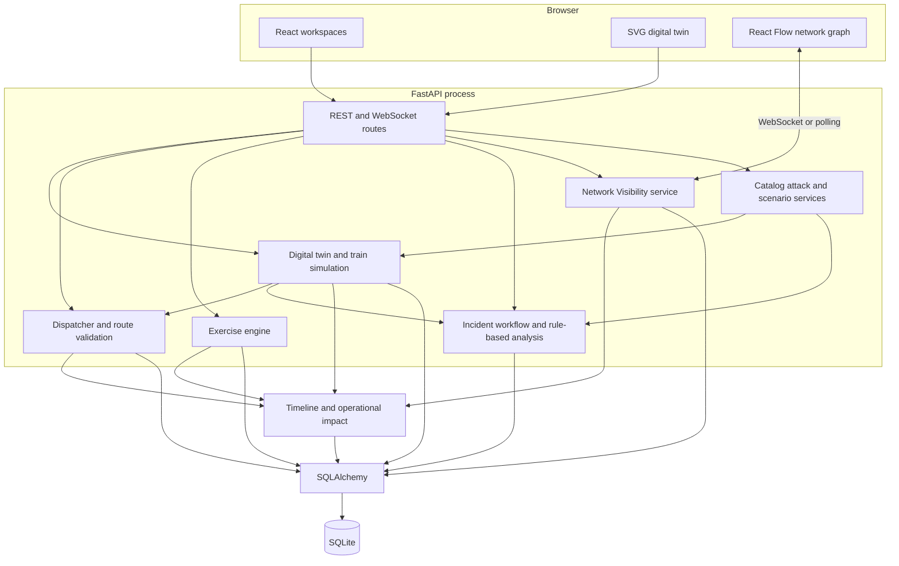

# TrackSentinel architecture

TrackSentinel is a local, monolithic training application with a React client, a FastAPI server, application-domain services, SQLAlchemy, and SQLite. It is not presented as production railroad control software or as a distributed cloud system.

## Logical architecture

## Component responsibilities

| Component | Responsibility |
|---|---|
| React application | Navigation, operational workspaces, forms, filtering, visual state, and polling/WebSocket clients |
| FastAPI routes | Request validation, response schemas, transactions, and domain-service entry points |
| Digital twin | Aggregates trains, blocks, signals, switches, crossings, OT relationships, consequences, and recovery state |
| Dispatcher | Validates routes and commands, models delays, maintains restrictions, and prevents unsafe operations |
| Exercise engine | Seeds definitions, creates runs, evaluates objectives, schedules events, scores actions, and generates AARs |
| Incident services | Creates and manages incidents and produces deterministic analysis |
| Network Visibility | Projects seeded/linked IT/OT nodes, connections, paths, and generated telemetry |
| SQLAlchemy / SQLite | Local persistence for application state and history |

## State and event flow

1. A user starts a catalog attack, custom scenario, exercise, or approved network simulation.
2. The backend validates the requested effect against the target asset’s supported capabilities.
3. The application updates only simulated records and related operational state.
4. Digital-twin and dispatcher services recalculate train, block, signal, switch, crossing, and route consequences.
5. Alerts, incidents, timeline events, and operational-impact metrics are generated where applicable.
6. Exercise objectives and scores evaluate the resulting authoritative state.
7. The frontend refreshes via REST polling; Network Visibility also attempts `/ws/network` and falls back to polling.

## Trust and safety boundaries

- The database and service layer are the only sources of operational truth.
- Network topology and telemetry are seeded or generated; they are not discovered from the host or a railroad network.
- Attack services use an allow-listed simulation catalog and do not contain exploit, malware, raw-socket, or scanning behavior.
- Dispatcher validation remains active under degraded communications and adversarial exercise conditions.
- `backend/ai_assistant.py` uses deterministic rules. No data is sent to an external model provider.

## Current deployment boundary

The supported documented deployment is two local development processes: Vite on port 5173 and Uvicorn on port 8000, backed by SQLite. Authentication, RBAC, multi-user coordination, PostgreSQL compatibility, containers, and cloud deployment are planned work.
