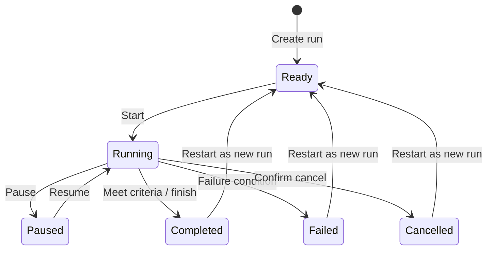

# Exercise Mode

Exercise Mode is TrackSentinel’s instructor-led railroad OT cyber range. It uses the same digital-twin, dispatcher, incident, network, and timeline services as the rest of the application; exercise completion is evaluated from authoritative application state rather than self-reported checkboxes.

**Status:** Exercise runs are available. Walkthroughs and after-action reporting are beta features under active refinement.

## Seeded exercise library

| Exercise | Category | Difficulty |
|---|---|---|
| Operation Broken Rail | Incident Response | Hard |
| Signal Failure Recovery | Signals | Medium |
| Communications Blackout | Communications | Hard |
| Dispatch Under Attack | Dispatcher | Expert |
| Dark Territory | Operations | Hard |
| PTC Outage | PTC | Hard |
| Switch Chaos | Operations | Expert |
| Grade Crossing Failure | Signals | Medium |

## Run lifecycle

Each run stores its briefing snapshot, objectives, score dimensions, elapsed time, timeline, checkpoints, hint usage, walkthrough reveal state, and terminal reason. Script events execute against the same approved simulation actions used by the main application.

## Objectives and guidance

Objectives may be automatic, manual, optional, or hidden. Automatic objectives evaluate structured conditions such as incident status, asset state, dispatch recovery, operational metrics, or unsafe-operation count. The UI shows:

- the action to take in plain language;
- current blockers and their observed state;
- the expected end result;
- progress and completion state;
- the relevant panel link when the definition supplies one.

Prevention objectives are maintained throughout the run. For example, a blocked unsafe route request is still an unsafe-operation violation; the exercise does not treat the block itself as harmless.

## Scoring

Runs expose overall, cyber, operations, safety, availability, and response-time scores. Objective points, hint penalties, walkthrough reveal penalties, unsafe actions, availability loss, and response timing feed the result. Exact scoring remains server-side so refreshing the browser cannot rewrite a score.

## Hints, checkpoints, and walkthroughs

- **Hints** are ordered and identify the panel and control needed for the next action.
- **Checkpoints** record a restorable run snapshot for training recovery.
- **Answer Sheet** is spoiler-protected and may apply a score penalty when revealed.
- **Instructor mode** exposes hidden objectives, notes, validation, and walkthrough context.
- **Walkthrough steps** show purpose, required action, expected result, verification condition, blockers, mistakes, recovery, hints, and panel links.

## After-action reports

Terminal runs produce an after-action report with mission summary, score, objective results, timeline evidence, safety events, hints, and completion/failure reason. The UI exposes Markdown, PDF, and JSON downloads through `/exercise-runs/{run_id}/after-action-report`.

## Exercise authoring

The visual builder and JSON import/export support custom definitions. Server validation checks required objective coverage and completion readiness. Exercise definitions should use only implemented condition types and approved simulation actions; unknown actions are rejected.

## Safety boundary

Exercises mutate local simulation records only. They do not scan networks, send attack traffic, execute malware, connect to railroad controllers, or weaken dispatcher route-safety enforcement.
